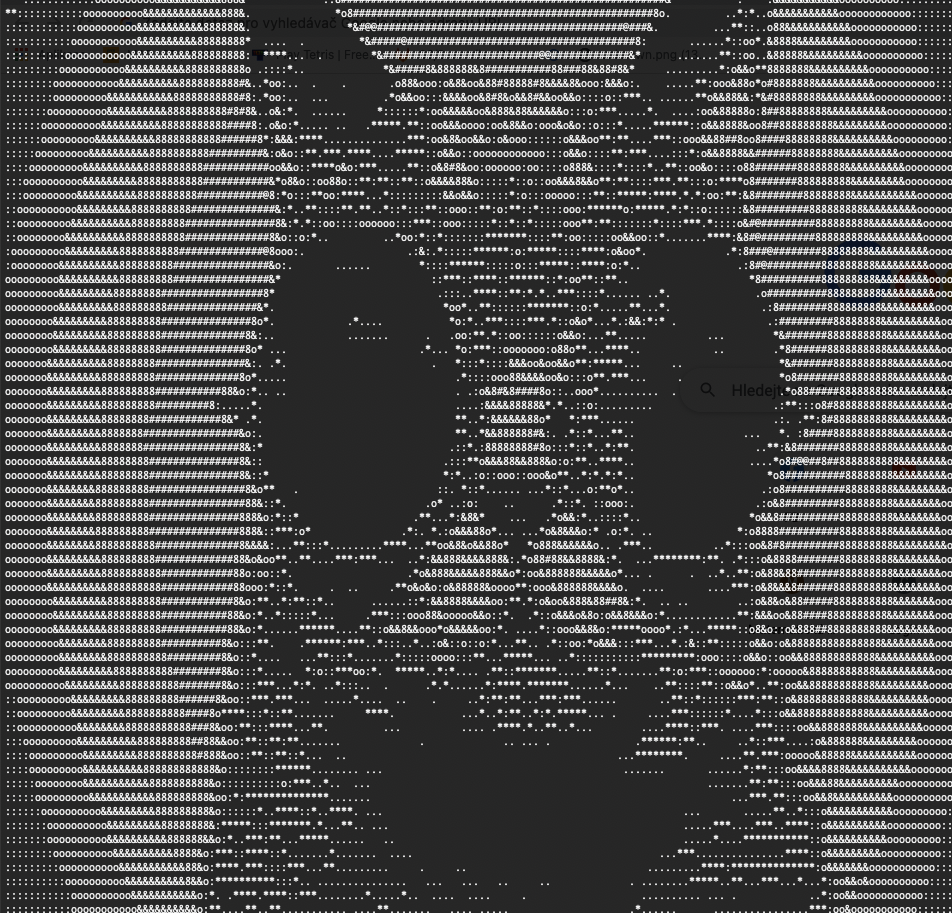

# ASCII ART Maker
An ASCII ART Maker application which can show images in ASCII.
## Functions
* Loads images of .tga or .bmp format from file or directory and shows them in ASCII.
* Applies simple filters to the image. Allows user to create custom filter combining filters.
* Loads custom ASCII transition.
* Allows you to play an animation from multiple images. 
* Simple video editing 

## How to use
Use simple commands to navigate throughout the application. 

